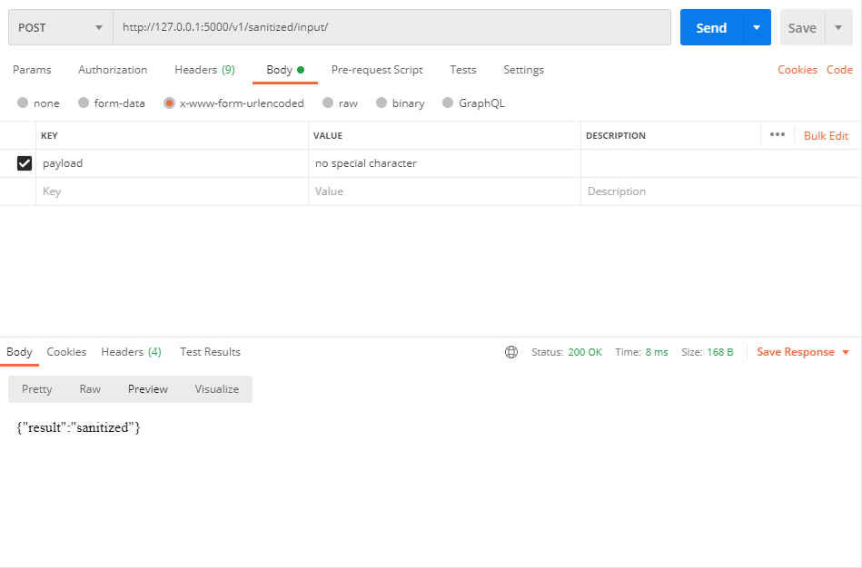
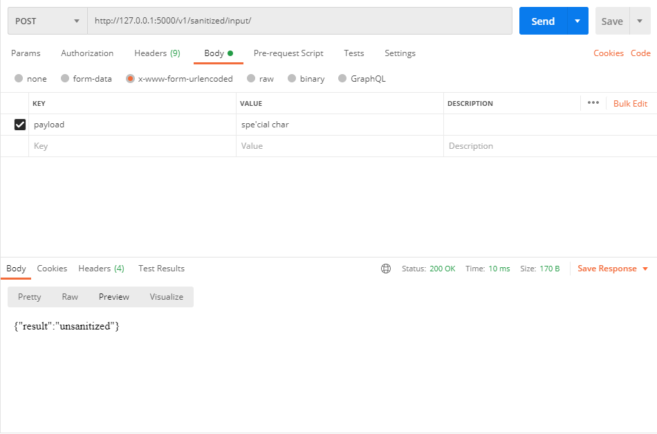
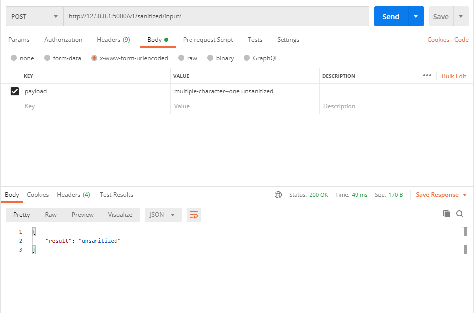

# SQL Injection Detection:

This program serves to detect if a string from user input contains a character that can be used for an SQL Injection.

## Examples:

#### A Safe Input:

### Input that contains a character:

